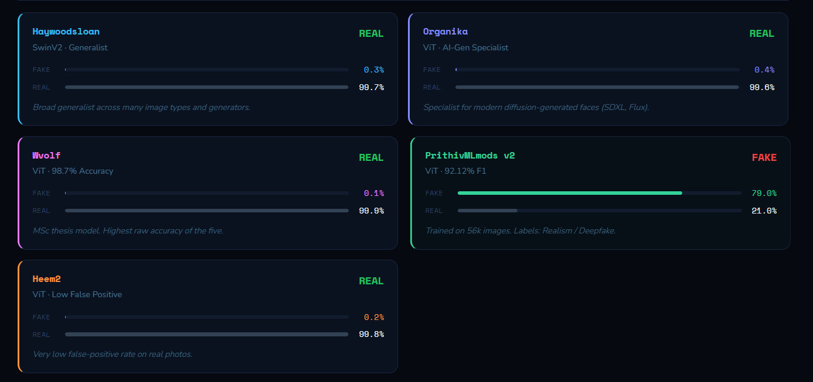

\# 🛡️ DeepShield — Deepfake Detection System

DeepShield is an AI-driven deepfake image detection platform developed using React and FastAPI. The system utilizes an ensemble of five specialized deep learning models to analyze uploaded images and determine whether the content is authentic or AI-generated.

By combining multiple detection models instead of relying on a single classifier, DeepShield improves prediction reliability, reduces false-positive results, and enhances overall detection performance.


## Key Features

- AI-powered deepfake image analysis
- Five-model ensemble detection architecture
- Real-time prediction and classification
- React-based responsive frontend
- FastAPI backend integration
- Ensemble voting mechanism for accurate results
- Support for advanced transformer-based models

## Integrated Detection Models

### Haywoodsloan
SwinV2-based general-purpose deepfake detector optimized for broad image analysis.

### Organika
Specialized detector focused on identifying SDXL and Flux AI-generated images.

### Vvolf
Vision Transformer (ViT)-based model with high-performance image classification capabilities.

### PrithviMLmods v2
Balanced ViT-based detection model designed for stable and reliable predictions.

### Heem2
Low false-positive detection model aimed at improving confidence and reducing incorrect classifications.

---

## Installation and Setup

### Backend Configuration

```bash
pip install -r requirements.txt
uvicorn backend:app --reload --port 8000
```

### Frontend Configuration

```bash
cd frontend
npm install
npm run dev
```

---

## System Workflow

1. User uploads an image through the frontend interface
2. The backend processes the uploaded image
3. Multiple AI models independently analyze the image
4. Ensemble voting logic determines the final prediction
5. The result is displayed instantly to the user

---

## Technology Stack

### Frontend
- React.js
- JavaScript
- CSS
- Vite

### Backend
- FastAPI
- Python
- Uvicorn

### Artificial Intelligence
- Vision Transformers (ViT)
- SwinV2 Architecture
- Hugging Face Models
- Ensemble Learning

---
## Future Enhancements

- Video deepfake detection
- Audio manipulation analysis
- Live camera verification
- Confidence score visualization
- Cloud-based deployment support

---

## Project Objective

The objective of DeepShield is to provide a reliable and scalable solution for detecting manipulated digital media using modern artificial intelligence techniques and ensemble deep learning systems.

---


### Final Result

