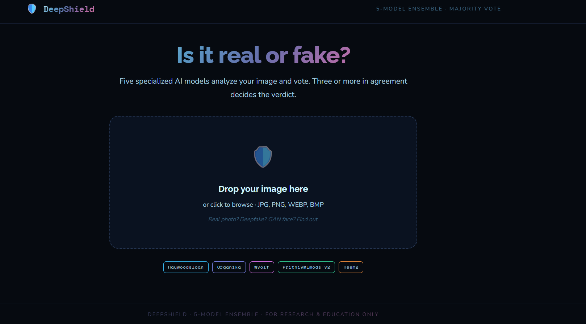
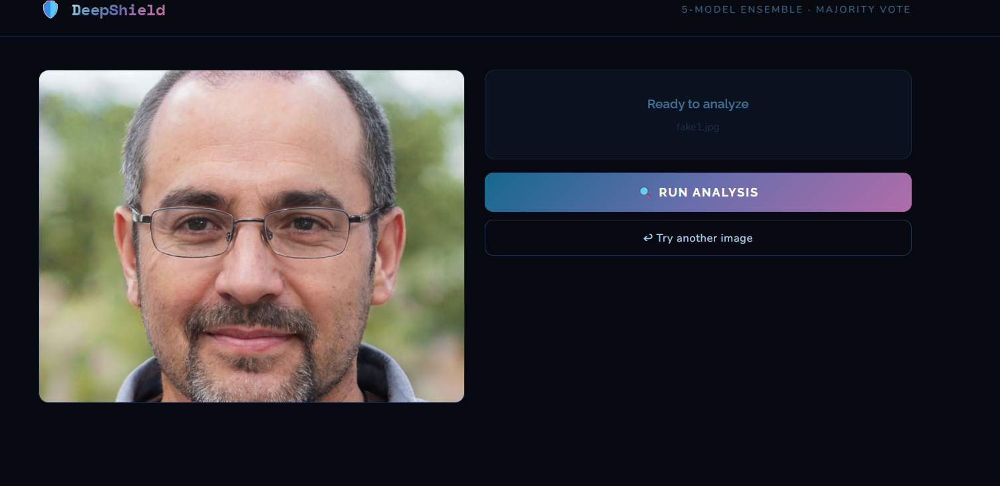
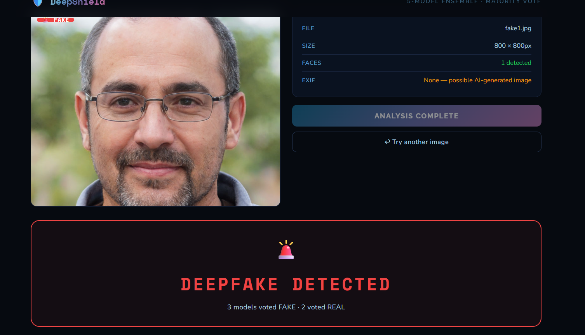
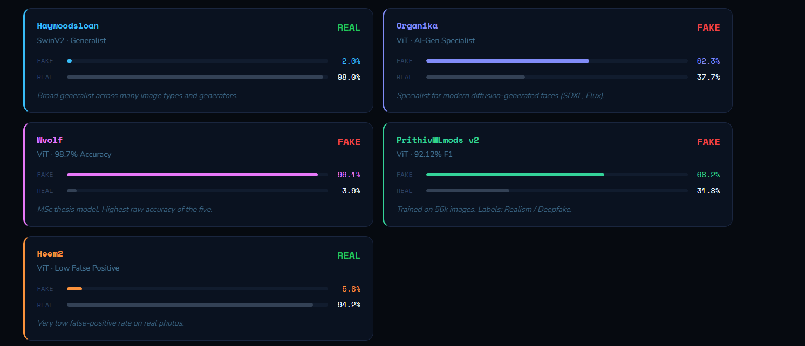
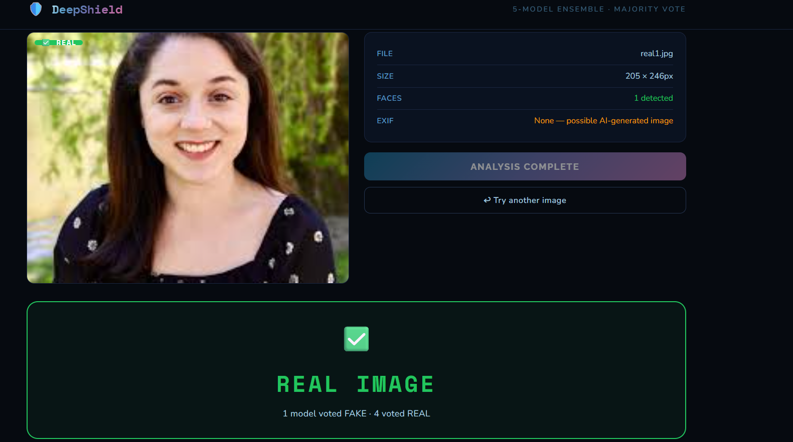

\# 🛡️ DeepShield — Deepfake Detection System


A 5-model ensemble deepfake detector built with React + FastAPI.

Upload any image and five specialized AI models vote on whether it's real or fake.


\## Models Used

\- \*\*Haywoodsloan\*\* — SwinV2 generalist

\- \*\*Organika\*\* — SDXL/Flux AI-generation specialist  

\- \*\*Wvolf\*\* — ViT, 98.7% accuracy

\- \*\*PrithivMLmods v2\*\* — ViT, 92.12% F1

\- \*\*Heem2\*\* — ViT, low false-positive rate


\## How to Run


\### Backend

```bash

pip install -r requirements.txt

uvicorn backend:app --reload --port 8000

```


\### Frontend

```bash

cd frontend

npm install

npm run dev

```


Open `http://localhost:5173`


## Screenshots

### Home Page


### Fake Image Selection


### Fake Image Upload


### Fake Prediction Result


### Real Image Upload


### Real Prediction Result


### Final Result

